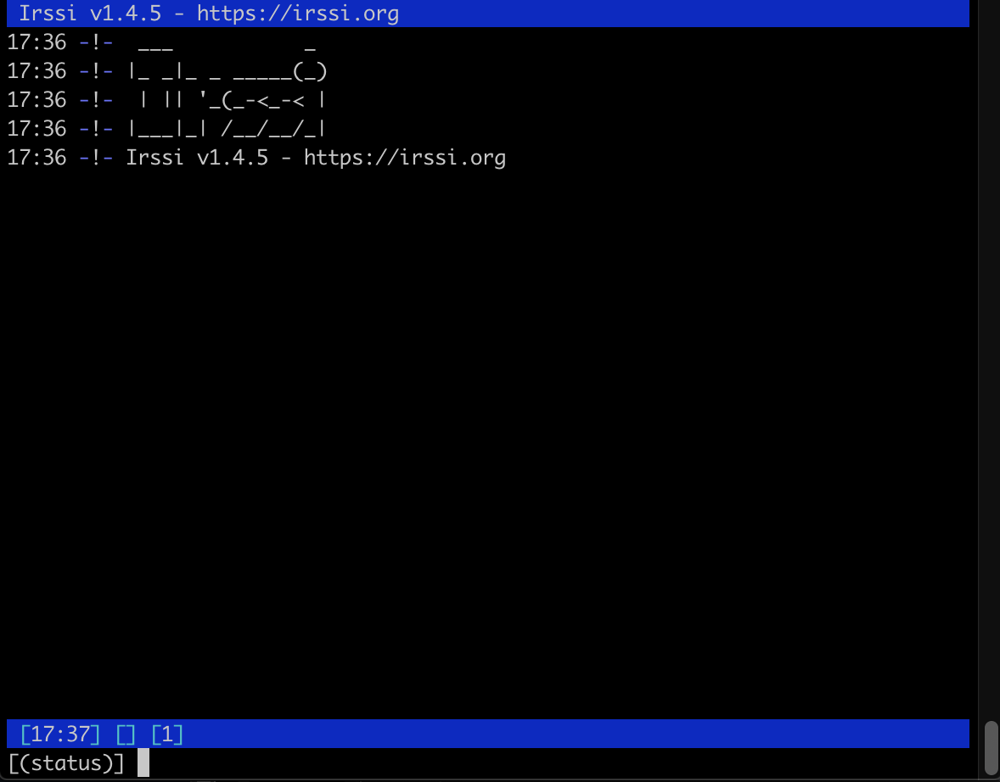
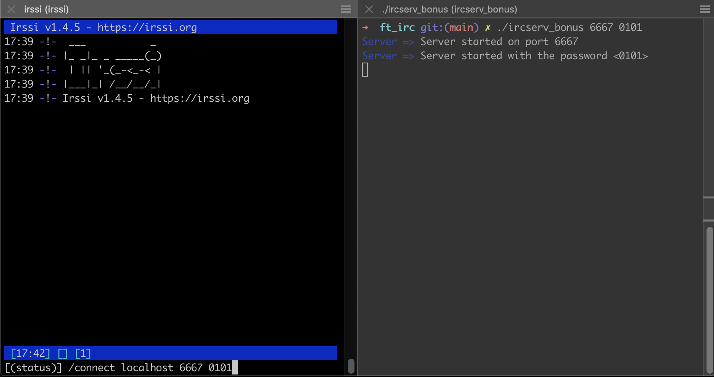

# ft_irc!


## Project Overview
**ft_irc** is a custom implementation of an IRC (Internet Relay Chat) server written in C++. This project is a team effort by two developers and is designed to emulate the behavior of an IRC server, enabling users to connect, join channels, and communicate in real-time using an IRC client like irssi.

This server also supports file transfers between users using the DCC (Direct Client-to-Client) protocol.

---

## Table of Contents
1. [Features](#features)
2. [Getting Started](#getting-started)
3. [Using irssi to Connect and Navigate](#using-irssi-to-connect-and-navigate)
4. [File Transfer Using DCC](#file-transfer-using-dcc)
5. [Acknowledgments](#acknowledgments)

---

## Features
- Multiple client connections.
- Channel creation and management.
- Real-time messaging.
- User modes and channel modes.
- Direct Client-to-Client (DCC) file transfers.

---

## Getting Started

### 1. Prerequisites
- A Unix-like operating system (Linux or macOS).
- A terminal-based IRC client (e.g., [irssi](https://irssi.org/)).
- C++ compiler (e.g., `g++`).

### 2. Build and Run the Server
1. Clone the repository:
   ```bash
   git clone https://github.com/Mohcine-Ghalmi/ft_irc
   cd ft_irc
   ```

2. Compile the server:
   ```bash
   make
   ```

3. Run the server:
   ```bash
   ./irc_server <port> <password>
   ```
   Replace `<port>` with the port number you want the server to listen on (e.g., `6667`).


### 3. Connect to the Server with irssi
1. Open a terminal and launch irssi:
   ```bash
   irssi
   ```


2. Connect to the server:
   ```
   /connect localhost <port> <password> 
   ```
   Replace `<port>` with the port number your server is running on.



---

## Using irssi to Connect and Navigate

### Simulating Two Users
To simulate two users interacting:
1. Open two terminal instances and start irssi in each:
   ```bash
   irssi --home ~/irssi_user1
   irssi --home ~/irssi_user2
   ```

2. In both irssi instances, connect to the server:
   ```
   /connect localhost <port>
   ```

3. Join the same channel (e.g., `#chat`):
   ```
   /join #chat
   ```

### Basic IRC Commands
- **Send a message in a channel:**
  ```
  /msg #<channel> <message>
  ```
  Example:
  ```
  /msg #chat Hello everyone!
  ```

- **Send a private message to another user:**
  ```
  /msg <username> <message>
  ```

- **List all available channels:**
  ```
  /list
  ```

- **Leave a channel:**
  ```
  /part #<channel>
  ```

- **Quit the server:**
  ```
  /quit
  ```

---

## File Transfer Using DCC

### Setting Up DCC in irssi
1. Set the download path for received files:
   ```
   /set dcc_download_path /desired/download/directory
   ```
   Replace `/desired/download/directory` with your preferred directory.

### Sending a File
1. From one irssi client (e.g., user1), send a file to another user (e.g., user2):
   ```
   /dcc send <username> /path/to/file
   ```
   Example:
   ```
   /dcc send user2 /tmp/testfile.txt
   ```

2. User2 will see a DCC SEND request in their irssi client:
   ```
   DCC SEND request from user1: testfile.txt (127.0.0.1:12345) [1024 bytes].
   ```

### Accepting a File
1. From the receiving irssi client (e.g., user2), accept the file transfer:
   ```
   /dcc get <username>
   ```
   Example:
   ```
   /dcc get user1
   ```

2. The transfer will begin, and progress updates will be displayed in the status window.

---

## Acknowledgments
This project was developed collaboratively as part of the 42 Network curriculum at 1337. Special thanks to:

[MOHAMED SARDA](https://github.com/Mohamedsarda)

---

## Notes
- Ensure the server port is open and not blocked by a firewall.
- irssi DCC transfers require proper configuration of network settings if used across different machines.

